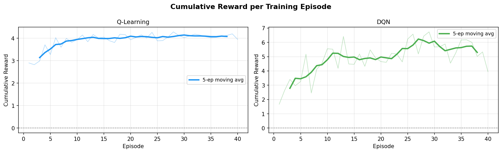
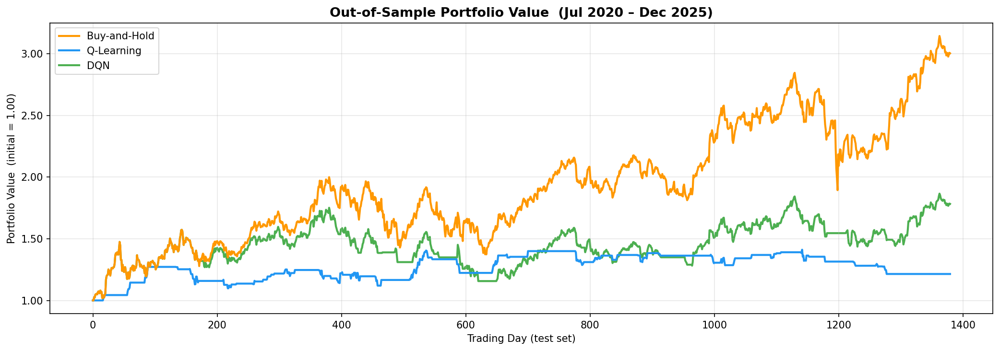
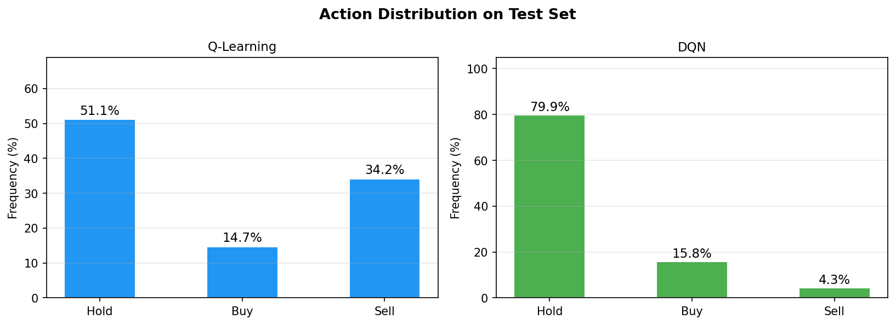
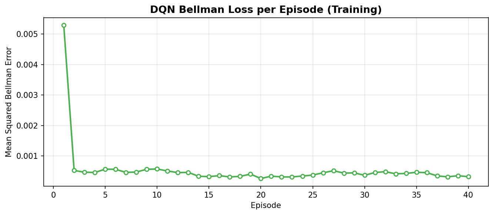
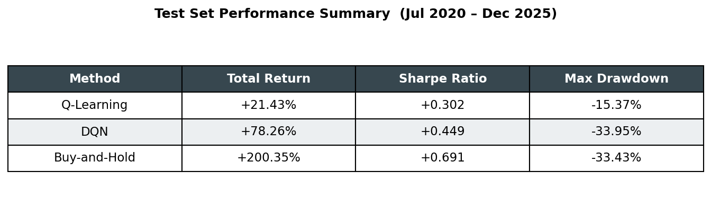
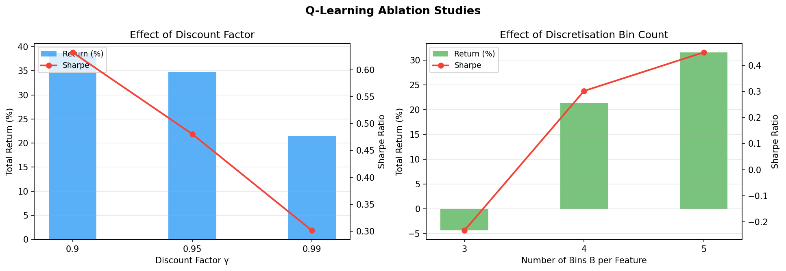

# Reinforcement Learning for Algorithmic Stock Trading

## Q-Learning and Deep Q-Network on AAPL Daily Data

### Abstract

This project studies whether reinforcement learning can learn a useful trading policy for Apple Inc. (AAPL) using daily historical market data and technical indicators. The trading problem is formulated as a Markov Decision Process in which an agent observes a seven-dimensional state, chooses one of three discrete actions, and receives a reward based on the next day's stock return and a transaction-cost penalty. Two reinforcement learning methods are implemented and compared: tabular Q-Learning and a Deep Q-Network (DQN) implemented from scratch in NumPy. The agents are trained on data from October 1998 to June 2020 and evaluated out of sample from July 2020 to December 2025. Their performance is compared against a passive Buy-and-Hold benchmark using cumulative return, Sharpe ratio, maximum drawdown, training behavior, action distributions, and ablation studies.

The results show that both reinforcement-learning agents produce positive out-of-sample returns, but neither beats Buy-and-Hold during the test period. Q-Learning achieves a total return of 21.43%, DQN achieves 78.26%, and Buy-and-Hold achieves 200.35%. The result is still meaningful: it shows that the agents learned trading behavior from technical indicators, while also demonstrating how difficult it is to outperform a strong passive benchmark during a major bull market in AAPL.

## 1. Introduction

Financial trading is a natural application area for reinforcement learning because it is sequential, uncertain, and reward-driven. A trader does not make a single isolated prediction; instead, they repeatedly observe market conditions, choose actions, and experience gains or losses over time. This structure is similar to the reinforcement learning setting, where an agent interacts with an environment and learns a policy that maximizes long-term reward.

The purpose of this project is to build a small but complete reinforcement learning study for algorithmic stock trading. The project focuses on Apple Inc. because AAPL is a liquid, widely traded stock with a long available history and strong market cycles. The agent is not given future prices. Instead, it observes technical indicators calculated from historical OHLCV data and decides whether to hold, buy, or sell.

The main research question is:

Can reinforcement learning learn a trading policy from technical indicators alone that performs competitively against a passive Buy-and-Hold baseline on unseen AAPL data?

This project compares a simple tabular method, Q-Learning, with a more flexible neural-network method, DQN. The comparison is useful because Q-Learning is easier to interpret and more stable on small datasets, while DQN can represent continuous state relationships more naturally but may be harder to train in noisy financial environments.

## 2. Dataset

The dataset is `AAPL_dataset.csv`, based on Reuters AAPL.OQ daily data. After removing warm-up rows with missing technical indicators, the usable dataset contains 6,841 daily observations.

The data period is:

| Split | Rows | Date range |
|---|---:|---|
| Training | 5,461 | 1998-10-16 to 2020-06-30 |
| Testing | 1,380 | 2020-07-01 to 2025-12-26 |
| Total | 6,841 | 1998-10-16 to 2025-12-26 |

The chronological split prevents future information from leaking into the training process. The agent learns only from the training period and is evaluated on the later test period. The test period is challenging because it includes several different market regimes, including the COVID recovery, the 2022 bear market, and the 2023-2024 AI-driven rally.

The dataset columns used by the project are:

| Column | Meaning |
|---|---|
| Date | Trading date |
| Open, High, Low, Close | Daily OHLC prices |
| Volume | Daily trading volume |
| RSI | Relative Strength Index |
| MACD | Moving Average Convergence Divergence |
| SMA_20 | 20-day simple moving average |
| SMA_200 | 200-day simple moving average |
| BB_PctB | Bollinger Band percent B |
| Log_Return | Daily log return |

## 3. MDP Formulation

The trading task is formulated as a Markov Decision Process.

### State Space

Each state is a seven-dimensional vector:

```text
[RSI / 100,
 MACD / Close,
 SMA_20 / Close - 1,
 SMA_200 / Close - 1,
 Bollinger %B,
 Log_Return,
 Current Position]
```

The first six values describe the market condition. The final value describes the agent's current position:

| Position value | Meaning |
|---:|---|
| 0 | Cash |
| 1 | Invested in AAPL |

The continuous features are clipped to reasonable ranges in the environment to avoid extreme values dominating the learning process.

### Action Space

The action space is discrete:

| Action | Meaning |
|---:|---|
| 0 | Hold current position |
| 1 | Buy, or enter an invested position |
| 2 | Sell, or move to cash |

If the agent buys while already invested, the position remains invested. If the agent sells while already in cash, the position remains cash. A transaction-cost penalty is applied only when a real position change occurs.

### Transition Dynamics

At each step, the agent observes the current row `t`, selects an action, and then the environment advances to the next row `t+1`. The reward is based on the forward return from the next trading day. This avoids look-ahead bias because the agent does not receive reward from a return already visible in the current state.

### Reward Function

The reward is:

```text
reward_t = position_after_action * log(C_{t+1} / C_t)
           - 0.001 * I[trade executed]
```

This means:

- The agent earns positive reward when it is invested before an up day.
- The agent earns negative reward when it is invested before a down day.
- The agent receives approximately zero market reward when it stays in cash.
- A 0.1% penalty is applied when the agent actually changes position.

The current implementation tracks the portfolio value using market exposure only:

```text
PV_{t+1} = PV_t * exp(position_after_action * log_return_{t+1})
```

Transaction costs are included in the learning reward but are not deducted from the plotted portfolio value. This distinction is important when interpreting the reported portfolio curves.

## 4. Methods

### 4.1 Q-Learning

Q-Learning is the tabular reinforcement learning method used in this project. Since the state contains continuous technical indicators, the first six state features are discretized into bins. The current position is already discrete.

With the default bin count `B = 4`, the theoretical number of states is:

```text
4^6 * 2 = 8,192 states
```

The Q-table therefore has shape:

```text
(B, B, B, B, B, B, 2, 3)
```

The final dimension stores Q-values for the three possible actions.

The Q-Learning update is:

```text
Q(s, a) <- Q(s, a) + alpha * [r + gamma * max_a' Q(s', a') - Q(s, a)]
```

The hyperparameters are:

| Parameter | Value |
|---|---:|
| Episodes | 40 |
| Learning rate alpha | 0.1 |
| Discount factor gamma | 0.99 |
| Epsilon start | 1.0 |
| Epsilon decay | 0.9995 |
| Epsilon minimum | 0.01 |
| Default bins | 4 |

Q-Learning is a good baseline because it is simple, stable, and interpretable. However, it loses information when continuous indicators are converted into discrete bins.

### 4.2 Deep Q-Network

The second method is a Deep Q-Network. Instead of storing Q-values in a table, the DQN approximates the Q-function with a neural network.

The architecture is:

```text
Input:  7 state features
Hidden: 64 ReLU units
Output: 3 Q-values, one for each action
```

The network is implemented from scratch in NumPy, including the forward pass, backpropagation, and Adam optimizer. No deep learning framework is used.

The DQN includes two standard stabilization techniques:

| Technique | Purpose |
|---|---|
| Experience replay | Stores previous transitions and trains on random mini-batches |
| Target network | Provides more stable Bellman targets |

The DQN hyperparameters are:

| Parameter | Value |
|---|---:|
| Episodes | 40 |
| Learning rate | 0.001 |
| Discount factor gamma | 0.99 |
| Replay buffer size | 3,000 |
| Batch size | 64 |
| Target update frequency | 200 training steps |
| Epsilon start | 1.0 |
| Epsilon decay | 0.9997 |
| Epsilon minimum | 0.01 |

DQN can represent smoother relationships in the continuous state space, but it may also be less stable because financial returns are noisy and the dataset is limited compared with typical deep learning datasets.

## 5. Experimental Design

The experiment has four main parts.

### Experiment 1: Main Performance Comparison

Q-Learning and DQN are trained on the same training period and evaluated on the same unseen test period. Their performance is compared against Buy-and-Hold.

### Experiment 2: Action Distribution

The actions selected by each trained agent are counted on the test set. This helps show whether the agent learned an active trading style or a more passive strategy.

### Experiment 3: Q-Learning Ablation

Two Q-Learning hyperparameter groups are tested:

| Ablation | Values |
|---|---|
| Discount factor gamma | 0.90, 0.95, 0.99 |
| Bin count B | 3, 4, 5 |

This evaluates how sensitive the tabular method is to planning horizon and state discretization.

### Experiment 4: DQN Loss

The mean Bellman loss is plotted over training episodes to inspect whether DQN training is stable.

## 6. Results

### 6.1 Training Rewards



The training reward curves show how each agent's reward evolves across 40 training episodes. Q-Learning updates a discrete Q-table and tends to stabilize as exploration decays. DQN learns through mini-batch updates from the replay buffer, so its reward behavior can be noisier because the neural network is constantly adjusting its approximation of the Q-function.

### 6.2 Out-of-Sample Portfolio Value



The out-of-sample portfolio plot compares Q-Learning, DQN, and Buy-and-Hold over the test period from July 2020 to December 2025. Buy-and-Hold produces the strongest final portfolio value because AAPL experienced a strong upward trend over much of the test period.

The RL agents still produce positive returns. However, they move in and out of the market, which can protect against some downside but can also cause them to miss major upward moves. In a strong bull market, missing large positive days can make it very difficult to beat a passive benchmark.

### 6.3 Action Distribution



The action distributions are:

| Agent | Hold | Buy | Sell |
|---|---:|---:|---:|
| Q-Learning | 51.1% | 14.7% | 34.2% |
| DQN | 79.9% | 15.8% | 4.3% |

Q-Learning is more active, especially in its sell decisions. DQN mostly holds, which suggests that it learned a less aggressive trading style. This difference helps explain the performance profiles: Q-Learning limits drawdown more than DQN, while DQN captures more upside but experiences a larger drawdown.

### 6.4 DQN Bellman Loss



The DQN loss curve tracks the mean squared Bellman error during training. This plot helps assess whether the neural network is learning stable Q-value estimates. In financial environments, some instability is expected because market data is noisy and non-stationary.

### 6.5 Metric Comparison



The final test-set metrics are:

| Method | Total return | Sharpe ratio | Maximum drawdown |
|---|---:|---:|---:|
| Q-Learning | 21.43% | 0.302 | -15.37% |
| DQN | 78.26% | 0.449 | -33.95% |
| Buy-and-Hold | 200.35% | 0.691 | -33.43% |

Buy-and-Hold has the highest return and Sharpe ratio. DQN is the stronger RL method in terms of total return, while Q-Learning has the smallest maximum drawdown. This indicates a tradeoff: the more conservative Q-Learning policy avoids some losses but misses much of the upside, while DQN captures more upside but accepts drawdown similar to Buy-and-Hold.

### 6.6 Ablation Studies



The Q-Learning ablation results are:

| Gamma | Total return | Sharpe ratio | Maximum drawdown |
|---:|---:|---:|---:|
| 0.90 | 38.75% | 0.632 | -13.02% |
| 0.95 | 34.79% | 0.481 | -13.73% |
| 0.99 | 21.43% | 0.302 | -15.37% |

Lower gamma values performed better in this run. This suggests that a shorter effective planning horizon may be more suitable for this noisy daily trading task than a very long horizon.

| Bin count | Total return | Sharpe ratio | Maximum drawdown |
|---:|---:|---:|---:|
| 3 | -4.36% | -0.233 | -10.25% |
| 4 | 21.43% | 0.302 | -15.37% |
| 5 | 31.59% | 0.449 | -26.68% |

The bin-count results show that discretization matters. Too few bins can oversimplify the state space, while more bins allow the agent to distinguish more market conditions. In this experiment, 5 bins improved return and Sharpe compared with the default 4 bins, but also increased maximum drawdown.

## 7. Discussion

The results show that reinforcement learning can learn meaningful trading behavior from technical indicators, but beating Buy-and-Hold is difficult when the test asset has a strong upward trend. AAPL performed very well over the test period, so a passive strategy that remained fully invested captured large gains. The RL agents sometimes moved to cash, which reduced exposure and helped avoid some downside, but also caused them to miss important gains.

Q-Learning was more conservative. It achieved the lowest maximum drawdown, but its total return was much lower than DQN and Buy-and-Hold. This is consistent with the action distribution, where Q-Learning sold much more often than DQN.

DQN achieved a higher return than Q-Learning because it remained invested more often and could use the continuous state representation more flexibly. However, its drawdown was nearly as large as Buy-and-Hold, and its Sharpe ratio was still below the passive baseline.

The ablation studies show that Q-Learning is sensitive to both discount factor and discretization. In this run, gamma = 0.90 performed better than gamma = 0.99, suggesting that short-term rewards may be more useful than long-term bootstrapping in this environment. A bin count of 5 improved return compared with 4 bins but increased drawdown, showing the risk of allowing a more detailed but potentially less stable state representation.

## 8. Limitations

There are several limitations.

First, the project uses only one stock. AAPL is a strong and unusual company, and results may not generalize to other assets.

Second, the state uses technical indicators only. It does not include macroeconomic variables, earnings information, news, volatility regimes, sector performance, or broader market context.

Third, the environment is simplified. It assumes perfect execution and does not model bid-ask spread, slippage, liquidity, taxes, or fractional constraints.

Fourth, transaction costs are included in the learning reward but not deducted from the plotted portfolio value. This is acceptable if clearly stated, but a stricter financial backtest should deduct costs directly from portfolio value.

Fifth, the DQN is intentionally small and implemented from scratch for educational purposes. More advanced deep reinforcement learning methods could improve stability and performance.

## 9. Reproducibility

The project can be reproduced from the repository using:

```bash
python run_all.py
```

This command runs:

1. `train.py`, which trains Q-Learning and DQN and evaluates them.
2. `experiments.py`, which runs the Q-Learning ablation studies.
3. `plot_results.py`, which regenerates all six figures.

The required Python packages are listed in `requirements.txt`:

```text
numpy>=1.24
pandas>=2.0
matplotlib>=3.7
```

The training scripts use `numpy.random.seed(42)` for reproducibility.

## 10. Conclusion

This project implemented a complete reinforcement learning pipeline for algorithmic trading on AAPL daily data. The task was formulated as an MDP with a seven-dimensional state, three discrete trading actions, and a reward based on forward returns and transaction costs. Two methods were implemented: tabular Q-Learning and a NumPy-based Deep Q-Network.

The final results show that both RL agents learned profitable out-of-sample behavior, but Buy-and-Hold remained the best strategy during the test period. Q-Learning produced a lower-risk but lower-return strategy, while DQN produced stronger returns with larger drawdown. The ablation studies further showed that Q-Learning performance depends meaningfully on the discount factor and state discretization.

The main takeaway is that reinforcement learning can be applied naturally to trading as a sequential decision-making problem, but profitable learning does not automatically imply outperformance against a strong passive benchmark. In this case, the agents learned useful policies, but the strong upward trend in AAPL from 2020 to 2025 made Buy-and-Hold very difficult to beat.

